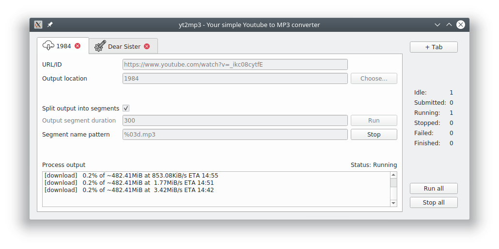

# Convenient, locally runnable youtube to mp3 file converter
You are using youtube for listening to music or podcasts, but are annoyed by the ads (especially on mobile devices), the requirement to leave your screen unlocked (especially on mobile devices), or the requirement to be online while doing so?
You are not keen (or too paranoid) to use any of the (often) sketchy online conversion websites for downloading youtube content, which package who-knows-what into the downloaded files? You want to be able to prepare your podcasts or publicly available audio books as mp3 files for travel or the gym?

Then you probably want to check out this convenient project providing simple youtube-to-mp3-conversion capabilities using [`ffmpeg`](https://github.com/FFmpeg/FFmpeg) and [`youtube-dl`](https://github.com/ytdl-org/youtube-dl) in a simple purposeful GUI.

Please note that this is in no way a professional or professionally maintained repository and mainly exists for my own benefit, learning experience and amusement.

---
## Requirements:

- `python3` (for downloading videos)
  + `youtube-dl`
- `ffmpeg` (for conversion and segmentation)
---

## How to use:



The tool can be used from terminal, or as a graphical user interface:

```
usage: yt2mp3.py [-h] [-sl SEGMENT_LENGTH] [-sn SEGMENT_NAME] [-o OUTPUT] [-n]
                 [video [video ...]]

Convert videos from Youtube to mp3 files!

positional arguments:
  video                 The URL or ID of the video to download and convert

optional arguments:
  -h, --help            show this help message and exit
  -sl SEGMENT_LENGTH, --segment_length SEGMENT_LENGTH
                        If given, the downloaded mp3 file will be divided into
                        segments of this length (in seconds)
  -sn SEGMENT_NAME, --segment_name SEGMENT_NAME
                        the naming pattern of the output mp3 file segments
  -o OUTPUT, --output OUTPUT
                        The destination file or folder the output shall be
                        written to.
  -n, --nogui           Setting this option runs yt2mp3 for a single video
                        without showing a GUI
```
Using above command option for example downloads a reading of George Orwell's "1984", splits it into segments of five minutes each and saves them as consecutively numbered (three digits each: default setting) mp3 files in a folder named "1984", ready for transfer to your portable audio player of choice.
```
python yt2mp3.py -sl 300 -o 1984 -n https://www.youtube.com/watch?v=_ikc08cytfE
```
